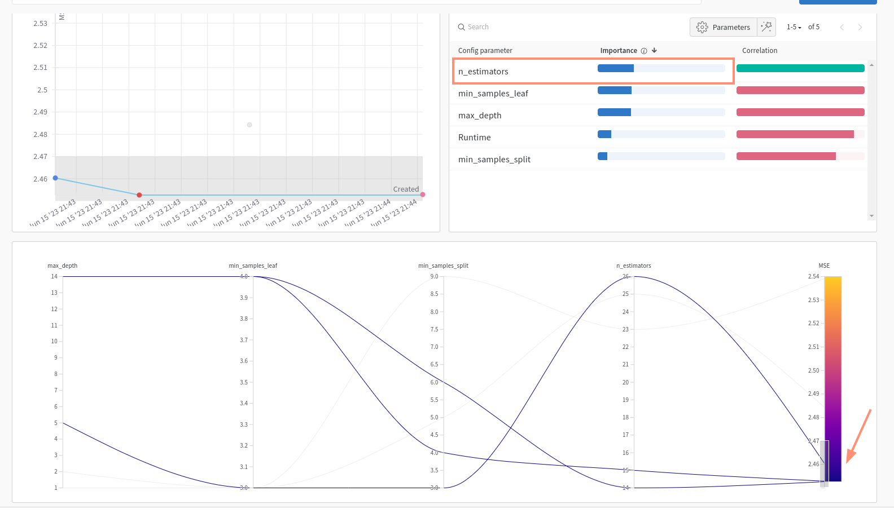
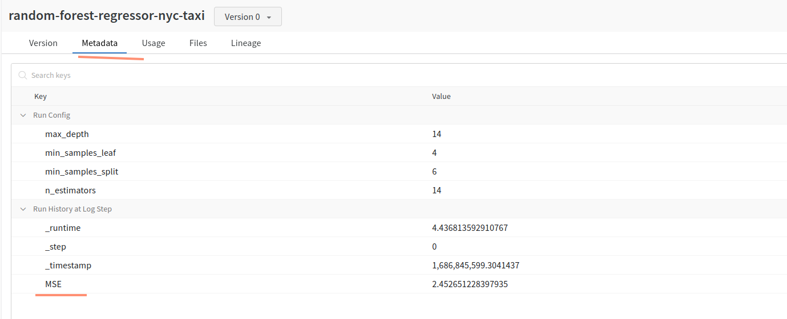

## Weights & Biases workshop

* Video: https://www.youtube.com/watch?v=yNyqFMwEyL4
* Github repository: https://wandb.me/mlops-zoomcamp-github


# Q1. Install the Package
To get started with Weights & Biases, you'll need to install the appropriate Python package.

For this, we recommend creating a separate Python environment. For example, you can use conda environments, and then install the package there with pip or conda.

The following are the libraries you need to install:

-    pandas
-    matplotlib
-    scikit-learn
-    pyarrow
-    wandb
Once you have installed the package, run the command wandb --version and check the output.

What's the version that you have?


# Q2. Download and preprocess the data

We'll use the Green Taxi Trip Records dataset to predict the amount of tips for each trip. 

Download the data for January, February and March 2022 in parquet format from [here](https://www1.nyc.gov/site/tlc/about/tlc-trip-record-data.page).

**Tip:** In case you're on [GitHub Codespaces](https://github.com/features/codespaces) or [gitpod.io](https://gitpod.io), you can open up the terminal and run the following commands to download the data:

```shell
wget https://d37ci6vzurychx.cloudfront.net/trip-data/green_tripdata_2022-01.parquet
wget https://d37ci6vzurychx.cloudfront.net/trip-data/green_tripdata_2022-02.parquet
wget https://d37ci6vzurychx.cloudfront.net/trip-data/green_tripdata_2022-03.parquet
```

Use the script `preprocess_data.py` located in the folder [`homework-wandb`](homework-wandb) to preprocess the data.

The script will:

* initialize a Weights & Biases run.
* load the data from the folder `<TAXI_DATA_FOLDER>` (the folder where you have downloaded the data),
* fit a `DictVectorizer` on the training set (January 2022 data),
* save the preprocessed datasets and the `DictVectorizer` to your Weights & Biases dashboard as an artifact of type `preprocessed_dataset`.

Your task is to download the datasets and then execute this command:

```bash
python preprocess_data.py \
  --wandb_project <WANDB_PROJECT_NAME> \
  --wandb_entity <WANDB_USERNAME> \
  --raw_data_path <TAXI_DATA_FOLDER> \
  --dest_path ./output
```

Tip: Go to `02-experiment-tracking/homework-wandb/` folder before executing the command and change the value of `<WANDB_PROJECT_NAME>` to the name of your Weights & Biases project, `<WANDB_USERNAME>` to your Weights & Biases username, and `<TAXI_DATA_FOLDER>` to the location where you saved the data.

Once you navigate to the `Files` tab of your artifact on your Weights & Biases page, what's the size of the saved `DictVectorizer` file?

* 54 kB
* 154 kB
* 54 MB
* 154 MB


```bash
python week2/homework-wandb/preprocess_data.py \
  --wandb_project WANDB_mlops_week2 \
  --wandb_entity manthanx \
  --raw_data_path ./week2/data/ \
  --dest_path ./week2/wandb_output
```


# Q3. Train a model with Weights & Biases logging

We will train a `RandomForestRegressor` (from Scikit-Learn) on the taxi dataset.

We have prepared the training script `train.py` for this exercise, which can also be found in the folder `homework-wandb`. 

The script will:

* initialize a Weights & Biases run.
* load the preprocessed datasets by fetching them from the Weights & Biases artifact previously created,
* train the model on the training set,
* calculate the MSE score on the validation set and log it to Weights & Biases,
* save the trained model and log it to Weights & Biases as a model artifact.

Your task is to modify the script to enable adding Weights & Biases logging, execute the script and then check the Weights & Biases run UI to ensure that the experiment run was properly tracked.

TODO 1: log `mse` to Weights & Biases under the key `"MSE"`

TODO 2: log `regressor.pkl` as an artifact of type `model`. Refer to the [official docs](https://docs.wandb.ai/guides/artifacts) for more information on logging artifacts.

You can run the script using:

```bash
python train.py \
  --wandb_project <WANDB_PROJECT_NAME> \
  --wandb_entity <WANDB_USERNAME> \
  --data_artifact "<WANDB_USERNAME>/<WANDB_PROJECT_NAME>/NYC-Taxi:v0"
```

Tip 1: You can find the artifact address under the `Usage` tab on the respective artifact's page.

Tip 2: Don't modify the hyperparameters of the model to ensure that the training will finish quickly.

Once you have successfully run the script, navigate the `Overview` section of the run in the Weights & Biases UI and scroll down to the `Configs`. What is the value of the `max_depth` parameter:

* 4
* 6
* 8
* 10


# Q4. Tune model hyperparameters

Now let's try to reduce the validation error by tuning the hyperparameters of the `RandomForestRegressor` using [Weights & Biases Sweeps](https://docs.wandb.ai/guides/sweeps). We have prepared the script `sweep.py` for this exercise in the `homework-wandb` directory.

Your task is to modify `sweep.py` to pass the parameters `n_estimators`, `min_samples_split` and `min_samples_leaf` from `config` to `RandomForestRegressor` inside the `run_train()` function. Then, we will run the sweep to determine not only the best of hyperparameters for training our model but also to analyze the most optimal trends in different hyperparameters. We can run the sweep using:

```bash
python sweep.py \
  --wandb_project <WANDB_PROJECT_NAME> \
  --wandb_entity <WANDB_USERNAME> \
  --data_artifact "<WANDB_USERNAME>/<WANDB_PROJECT_NAME>/NYC-Taxi:v0"
```

This command will run the sweep for 5 iterations using the **Bayesian Optimization and HyperBand** method, as proposed by the paper [BOHB: Robust and Efficient Hyperparameter Optimization at Scale](https://arxiv.org/abs/1807.01774). You can take a look at the sweep on your Weights & Biases dashboard, examine at the **Parameter Importance Panel** and the **Parallel Coordinates Plot** to determine and analyze which hyperparameter is the most important:

* `max_depth`
* `n_estimators`
* `min_samples_split`
* `min_samples_leaf`




# Q5. Link the best model to the model registry

Now that we have obtained the optimal set of hyperparameters and trained the best model, we can assume that we are ready to test some of these models in production. In this exercise, you'll create a model registry and link the best model from the Sweep to the model registry.

First, you will need to create a Registered Model to hold all the candidate models for your particular modeling task. You can refer to [this section](https://docs.wandb.ai/guides/models/walkthrough#1-create-a-new-registered-model) of the official docs to learn how to create a registered model using the Weights & Biases UI.

Once you have created the Registered Model successfully, you can navigate to the best run of your sweep, go to the model artifact created by the particular run, and click on the `Link to Registry` option in the UI. This will link the model artifact to the Registered Model. You can choose to add some suitable aliases for the Registered Model, such as `production`, `best`, etc.

Now that the model artifact is linked to the Registered Model, what information do we see on the Registered Model UI?

* Versioning
* Metadata
* Aliases
* Metric (MSE)
* Source run
* All of these
* None of these





```python

```
